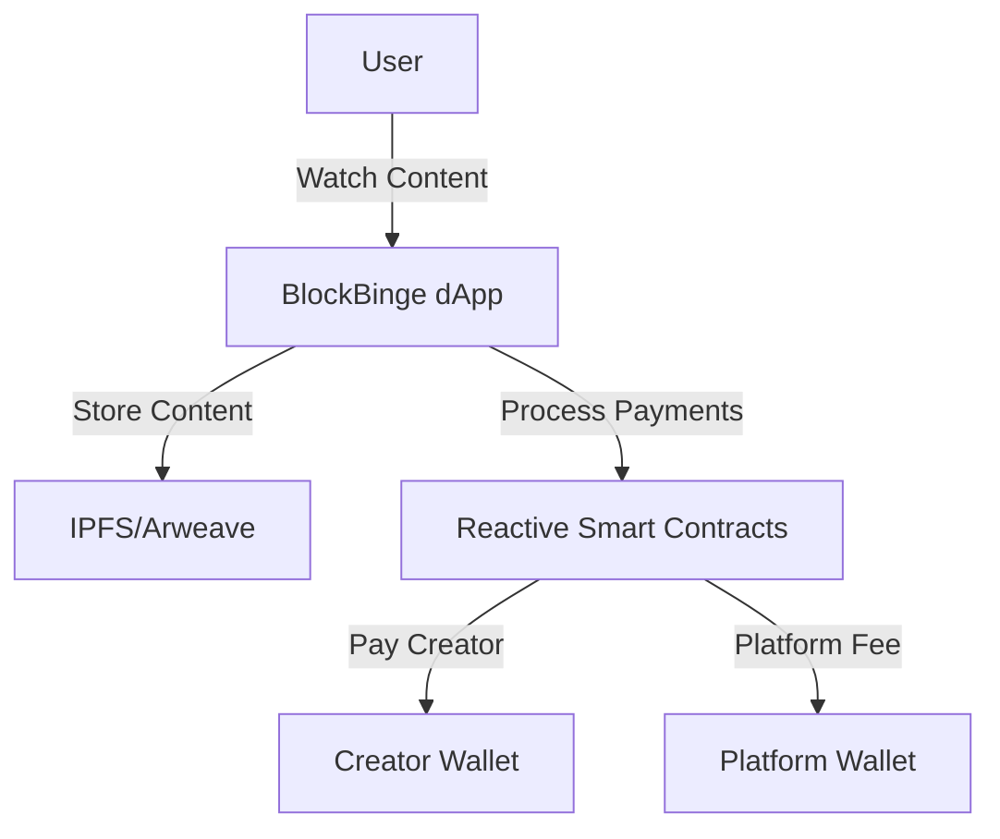

<div align="center">

# 🎬 BlockBinge - Decentralized Pay-Per-View Streaming Platform


> *Watch what you want, pay for what you watch. A revolutionary Web3 streaming platform powered by Reactive Smart Contracts.*

[](https://opensource.org/licenses/MIT)
[](https://reactjs.org/)
[](https://ipfs.io/)
[](https://blockbinge.vercel.app/)

[View Demo](https://blockbinge.vercel.app/) | [Smart Contracts](https://github.com/AbhigyaKrishna/block-binge-contracts) | [Frontend Code](https://github.com/vaibhavkothari33/BlockBinge)

</div>

## 🞳 Features

- **💰 Pay-Per-View**: Only pay for the content you actually watch
- **⚡ Real-Time Payments**: Automated microtransactions using Reactive Smart Contracts
- **🎯 Fair Revenue**: Direct payments to content creators with minimal platform fees
- **🔒 Decentralized**: Content stored on IPFS/Arweave for censorship resistance
- **💸 Flexible Pricing**: Support for per-second and flat-rate pricing models

## 🏗️ Architecture


## 🛠️ Tech Stack

- **Smart Contracts**: Solidity ^0.8.19
- **Blockchain**: Ethereum/Polygon
- **Storage**: IPFS/Arweave
- **Payment System**: Reactive Smart Contracts
- **Frontend**: React.js (coming soon)

## 📦 Installation

1. Clone the repository
    ```bash
    git clone https://github.com/AbhigyaKrishna/block-binge-contracts.git
    cd block-binge-contracts
    ```

2. Install dependencies
    ```bash
    forge install
    ```

3. Set up deployment script
    ```bash
    cp .deploy-example.sh .deploy.sh
    chmod +x .deploy.sh
    ```

4. Fill in the details in the deployment script

5. Run the deployment script
    ```bash
    ./deploy.sh
    ```

## 📊 Payment Flow

1. User starts watching content
2. RSC tracks viewing duration
3. Payments processed automatically
4. Revenue split between creator and platform
5. Daily payment settlement

## 🛡 Security

- Reentrancy protection
- Access control mechanisms
- Secure payment processing

## ♡ Contributing

We welcome contributions! Please check our [Contributing Guidelines](CONTRIBUTING.md).

## 📝 License

MIT License - see the [LICENSE](LICENSE) file for details

## 🤝 Contact

| Name | Role | GitHub | X | LinkedIn |
|------|------|--------|---------|----------|
| Abhigya Krishna | Blockchain developer | [@AbhigyaKrishna](https://github.com/AbhigyaKrishna) | [@AbhigyaKr1shna](https://x.com/AbhigyaKr1shna) | [Abhigya Krishna](https://www.linkedin.com/in/abhigya-krishna/) |
| Navya Rathore | Gen AI developer | [@NavyaRathore](https://github.com/NavyaRathore) | [@eliza_darcy_01](https://x.com/eliza_darcy_01) | [Navya Rathore](https://www.linkedin.com/in/navya-rathore/) |
| Vaibhav Kothari | Frontend Developer | [@vaibhavkotharii](https://github.com/vaibhavkothari33) | [@VaibhavKotharii](https://x.com/VaibhavKotharii) | [Vaibhav Kothari](https://www.linkedin.com/in/vaibhavkothari33/) |
| Shrijan Katiyar | Technical Writer | [@youtubee](https://github.com/youutubee) | - | [Shrijan Katiyar](https://www.linkedin.com/in/shrijan-katiyar-49b068286/) |


---

<p align="center">
  Built with ❤️ by Coffee < Code > Crew
</p>

